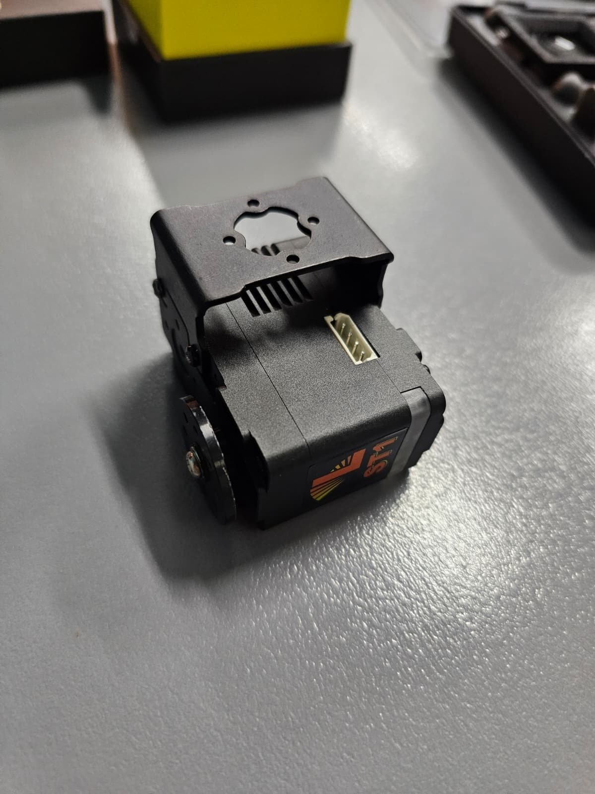
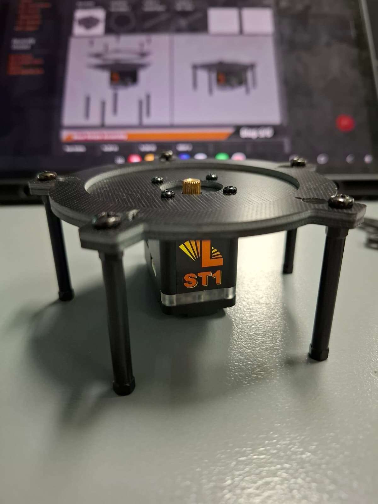
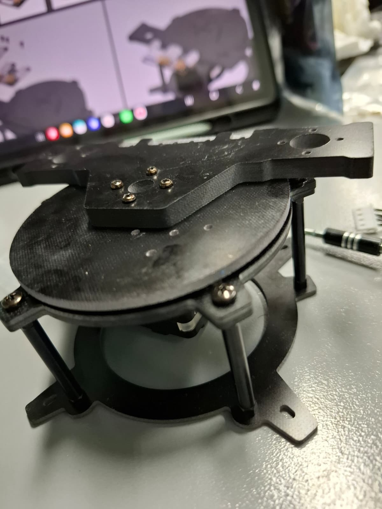
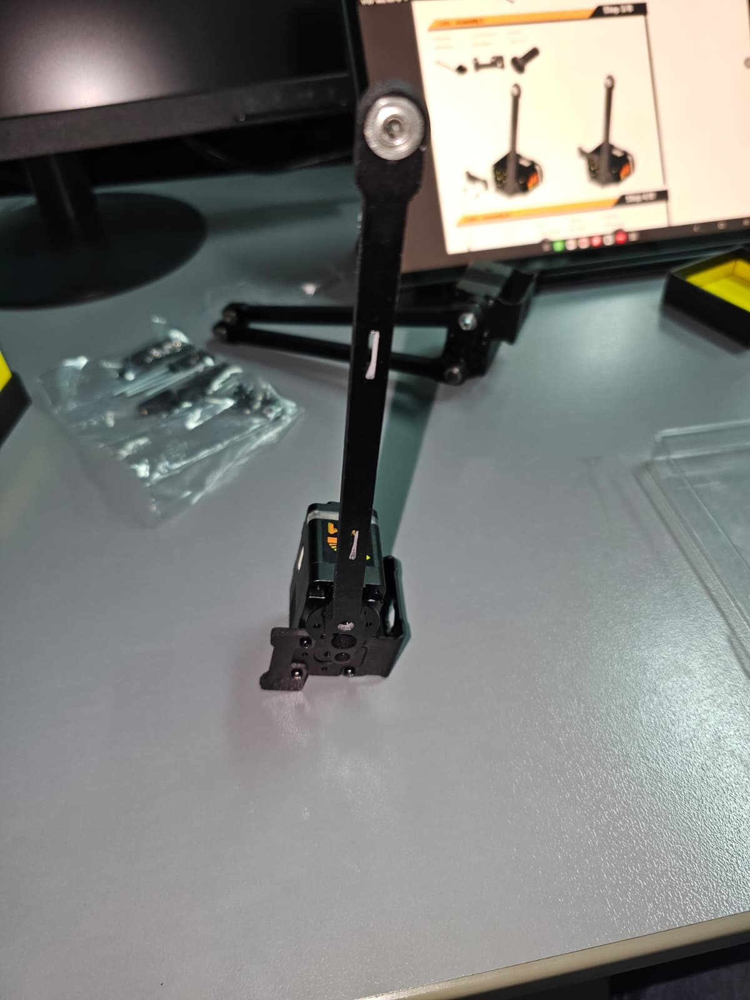
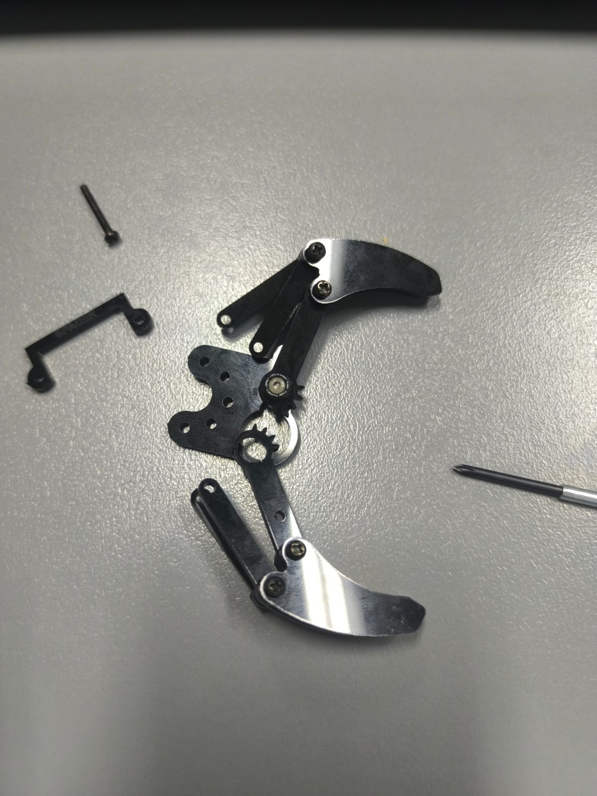
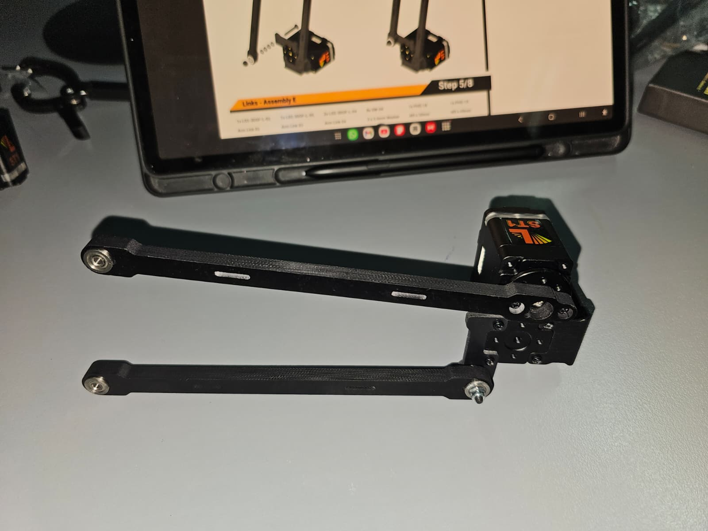
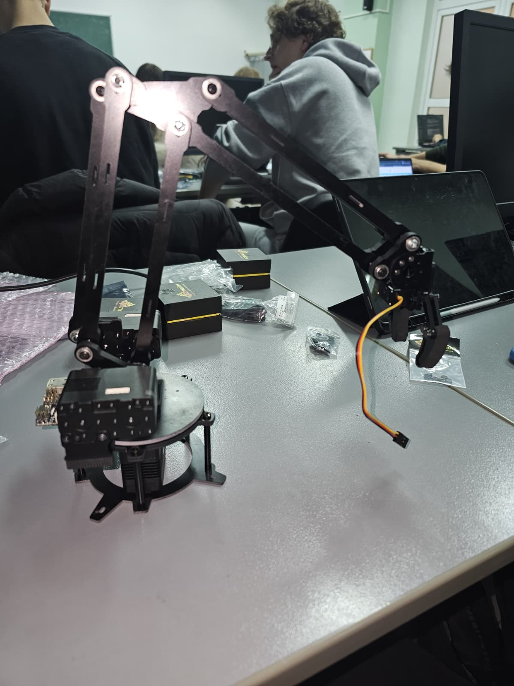
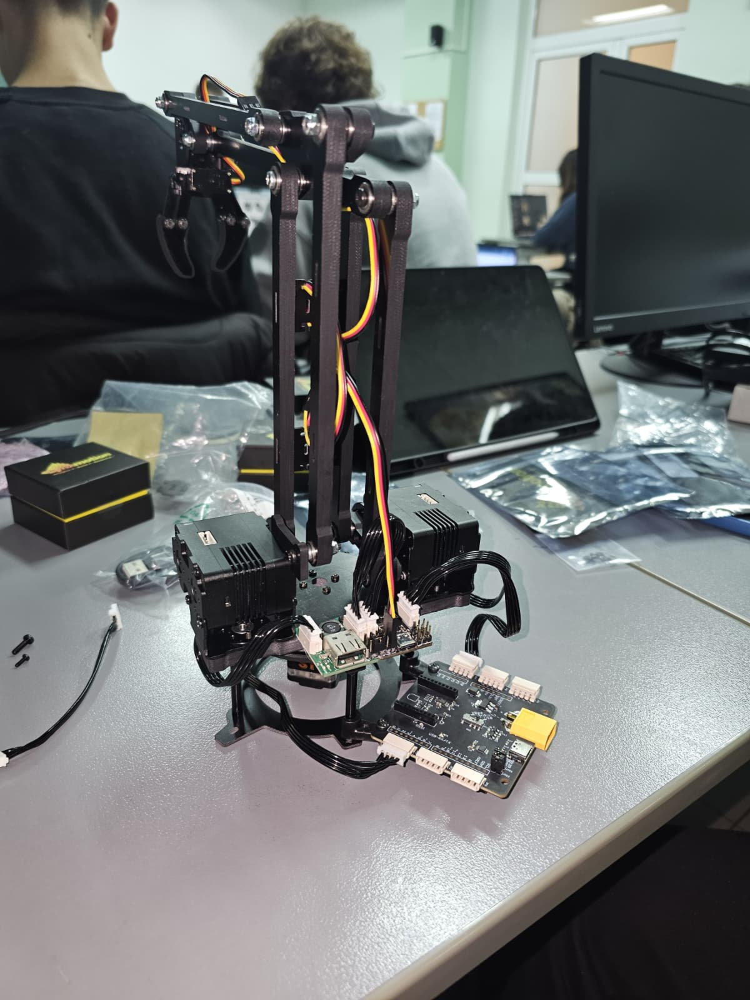

# Proiect: Asamblarea robotului [Lynxmotion SES-V2 Robotic Arm (3 DoF)]

## Echipa
- Nume echipă: http418
- Moto: I'm a teapot
- Participanți:
  - Rusu Alexandru
  - Nedelcu Răzvan-Daniel
  - Bucur Bogdan-Cristian
  - Vlad Alexandru

## Descriere generală
Scopul proiectului este **asamblarea și testarea brațului robotic Lynxmotion SES-V2 Robotic Arm (3 DoF)**, în cadrul laboratorului APD. Documentația prezintă în mod structurat pașii de montaj mecanic, conectare electronică, configurare software de bază și testare funcțională.

Pe parcursul majorității ședințelor de laborator, activitatea a fost concentrată pe **asamblarea fizică a robotului**, platforma fiind una modulară și necesitând atenție ridicată la alinierea componentelor. Etapa de control software a fost realizată la final, utilizând aplicațiile oficiale puse la dispoziție de producător.

## Checklist componente

| Componentă | Cod / Denumire | Cantitate | Observații |
|---|---|---:|---|
| Base Rotate Kit | LSS-BR-KT | 1 | rotație bază |
| Mini Gripper Kit | SES-MG-KT | 1 | efector final |
| Servomotoare inteligente | LSS-ST1 | 3 | axe braț |
| Adaptor LSS | LSS-ADA | 1 | interfață control |
| Modul I/O | LSS-2IO | 1 | control digital |
| Regulator tensiune 5V | LSS-5VR | 1 | alimentare logică |
| Sursă alimentare 12V XT60 | BX-12006000-XT60 | 1 | alimentare sistem |
| Cablu USB | USBC-02 | 1 | conexiune PC |
| Cablu date 100mm | LSS-C-100-S | 3 | conexiuni servo |
| Cablu Y 150mm | LSS-C-150-Y | 1 | ramificare date |
| Extensie cablu 6 inch | SEA-01 | 1 | extensie |
| Extensie cablu 12 inch | SEA-02 | 1 | extensie |
| Segment braț Link #1 | LSS-3DOF-L-01 | 1 | structură |
| Segment braț Link #2 | LSS-3DOF-L-02 | 5 | structură |
| Segment braț Link #3 | LSS-3DOF-L-03 | 1 | structură |
| Segment braț Link #4 | LSS-3DOF-L-04 | 2 | structură |
| Segment braț Link #5 | LSS-3DOF-L-05 | 1 | structură |
| Segment braț Link #6 | LSS-3DOF-L-06 | 1 | structură |
| Placă bază | LSS-3DOF-BP | 1 | suport bază |
| Suport spate | LSS-3DOF-BS | 1 | rigidizare |
| Suport cablu mic | LSS-3DOF-CT-S | 2 | management cabluri |
| Suport cablu mare | LSS-3DOF-CT-L | 2 | management cabluri |
| Suport lat | ASB-28 | 2 | prindere mecanică |
| Suport mini C | ASB-43 | 1 | prindere mecanică |
| Clips electronic | AHS-EC | 2 | fixare module |
| Coliere | ZT-07in | 4 | organizare cabluri |
| Șurub 2-56 1/4" | PHS-02 | 27 | prindere |
| Șurub 2-56 1/2" | PHS-05 | 12 | prindere |
| Șurub M3 10mm | PHS-16 | 2 | prindere |
| Șurub M3 20mm | PHS-17 | 4 | prindere |
| Șurub M3 30mm | PHS-18 | 2 | prindere |
| Șurub M3 40mm | PHS-19 | 2 | prindere |
| Piuliță M3 | SLN-03 | 8 | fixare |
| Șurub autofiletant #2 | PHTS-01 | 15 | fixare |
| Șaibă 3 x 5.6mm | SW-04 | 26 | distribuție forță |

### Pregătirea spațiului de lucru

Înainte de montaj, au fost respectate următoarele etape:

-   organizarea pieselor pe categorii (plăci, șuruburi, servomotoare)
    
-   verificarea integrității mecanice a componentelor

## Asamblare pas cu pas

Asamblarea mecanică a fost realizată etapizat, urmând ghidul oficial al producătorului și respectând principiile de montaj modular specifice sistemului SES‑V2.

| Servo Setup – Assembly A | Base Rotate Assembly |
|---|---|
|  |  |
| Pregătirea servomotoarelor LSS-ST1 pentru montaj. | Asamblarea mecanismului de rotație a bazei. |

| Base Assembly | Links Assembly – structură |
|---|---|
|  |  |
| Stabilizarea bazei și montajul suporturilor. | Montarea segmentelor principale ale brațului. |

| Mini Gripper – asamblare | Links Assembly – configurare finală |
|---|---|
|  |  |
| Asamblarea efectorului final. | Ajustarea și fixarea articulațiilor. |

| Ansamblu aproape final | Ansamblu final |
|---|---|
|  |  |
| Structură completă mecanic, pregătită pentru testare. | Configurația finală a brațului robotic. |

## Software

Pentru testare și control s-a utilizat **software-ul oficial Lynxmotion LSS**.

### Detectarea servomotoarelor

După conectare, software-ul permite scanarea  și detectarea automată a servomotoarelor. Fiecărui servo îi este asociat un **ID unic**, necesar pentru adresare individuală.
    
După validarea fiecărui servo, a fost testat întregul ansamblu.

### Testarea funcționalității

Au fost executate următoarele mișcări:

-   rotația bazei stânga–dreapta
    
-   ridicarea și coborârea brațului principal
    
-   flexia antebrațului
    

Mișcările au fost realizate lent, pentru a observa eventuale probleme mecanice.

În etapa finală, au fost testate mișcări combinate, care implică mai multe articulații simultan. Acest test demonstrează capacitatea brațului de a executa traiectorii simple și validează stabilitatea structurii.

---    

Configurarea prin Arduino IDE sau Python nu a fost abordată extensiv, accentul laboratorului fiind pus pe asamblare și testare hardware.

## Observații și concluzii
-   Asamblarea mecanică necesită atenție ridicată la alinierea pieselor
    
-   Organizarea șuruburilor este esențială pentru evitarea erorilor
    
-   Majoritatea timpului de laborator a fost alocat montajului, ceea ce a limitat activitatea de programare

Proiectul a permis înțelegerea practică a:

-   structurii unui manipulator robotic
    
-   utilizării servomotoarelor inteligente
    
-   relației dintre mecanică, electronică și software
    

Deși timpul alocat controlului avansat a fost limitat, obiectivul principal – **asamblarea și testarea funcțională a brațului robotic Lynxmotion SES‑V2 (3 DoF)** – a fost îndeplinit cu succes. Acest proiect constituie o bază solidă pentru dezvoltări ulterioare, precum control cinematic sau integrarea cu microcontrolere și limbaje de programare.

## Referințe

-   [Lynxmotion – SES‑V2 3 DoF Arm Quickstart Guide](https://wiki.lynxmotion.com/info/wiki/lynxmotion/view/ses-v2/ses-v2-arms/lss-3-dof-arm/3dof-arm-quickstart/)

## Progres echipă

| Nr. | Etapă                         | Descriere scurtă                                  | Status | Data finalizării |
|-----|-------------------------------|--------------------------------------------------|---------|------------------|
| 1 | Verificare componente          | Inventarierea pieselor și verificarea integrității | ✅ | 12.11.2025 |
| 2 | Montaj mecanic                 | Asamblarea bazei, fixarea motoarelor, șuruburi etc. |  ✅ | 3.12.2025 |
| 3 | Conectare electronică          | Conectarea controlerului, cabluri, alimentare     |  ✅ | 10.12.2025 |
| 4 | Configurare software           | Instalarea softului, identificarea și calibrarea servo-urilor | ✅ | 10.12.2025 |
| 5 | Test inițial mișcare           | Verificarea mișcărilor de bază       | ✅ | 10.12.2025 |
| 6 | Test final                     | Verificare completă a funcționării robotului      | ✅ | 10.12.2025 |
| 7 | Documentare și imagini         | Scriere README, poze, diagrame, linkuri utile     | ✅ | 05.01.2026 |
| 8 | Prezentare finală              | Demonstrație funcțională în laborator             | ✅ | 14.01.2026 |

Legenda status:  
✅ = Finalizat  ⏳ = În desfășurare  ❌ = Neînceput